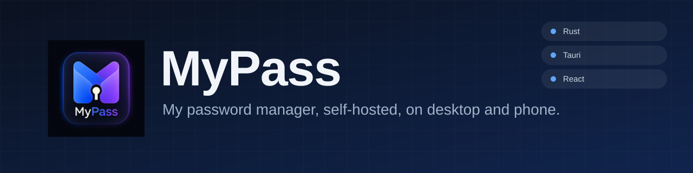
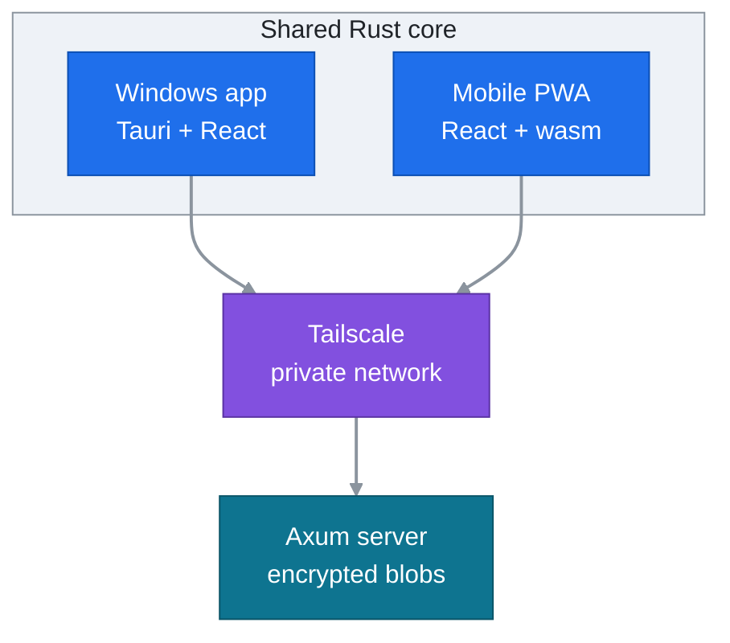
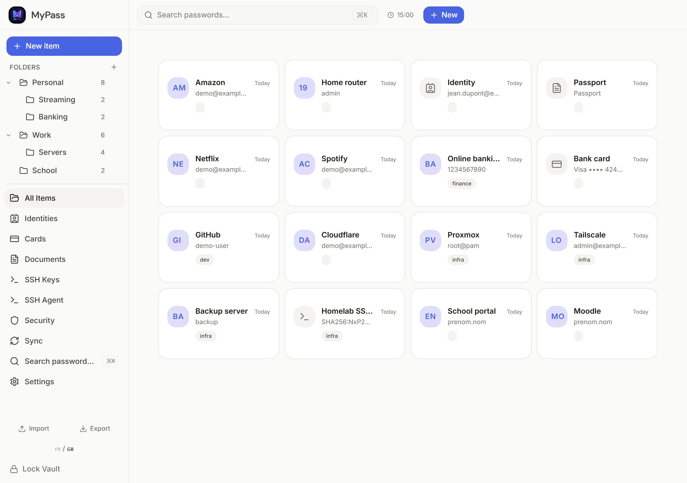
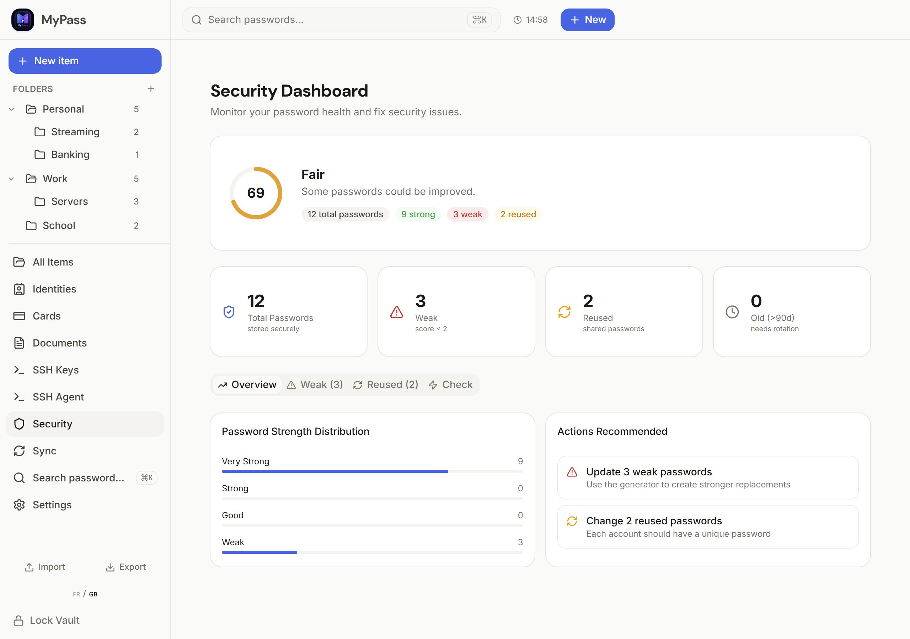
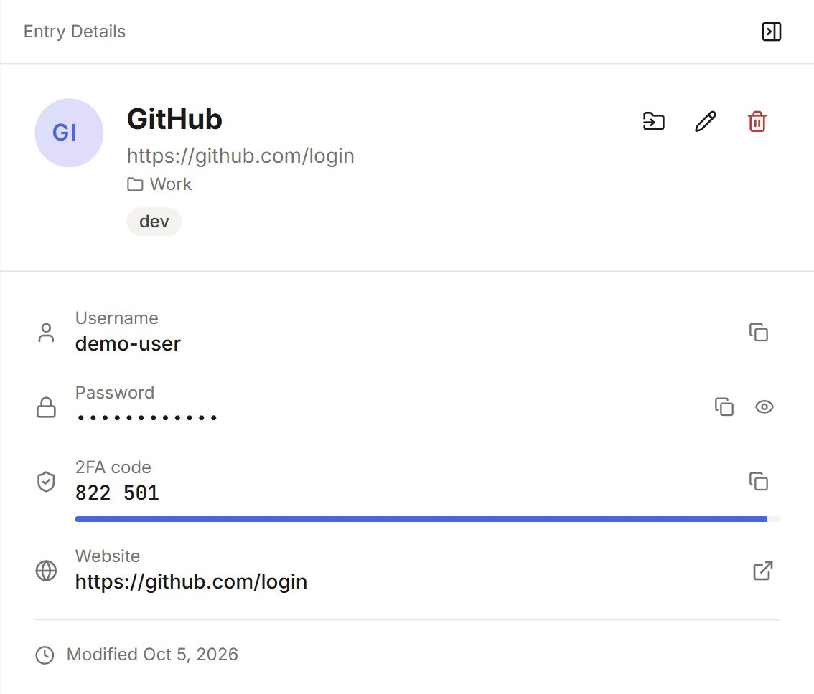

<div align="center">

<picture>
  <source media="(max-width: 600px)" srcset="assets/en/banner-mobile.svg">
  
</picture>

### One encrypted vault, synced between my PCs and my phone.


[Français](README.md) · **English**

[At a glance](#at-a-glance) · [The solution](#the-solution) · [Preview](#preview) · [Technical choices](#technical-choices) · [Installation](#installation)

<p align="center">
  <picture>
    <source media="(max-width: 600px)" srcset="assets/en/stats-mobile.svg">
    <source media="(prefers-color-scheme: dark)" srcset="assets/en/stats-dark.svg">
    
  </picture>
</p>

</div>

## At a glance

| Topic | Detail |
|:--|:--|
| **Context** | Personal project, used every day in place of my previous password manager |
| **My role** | Design, technical choices and deployment. The code is written with Claude Code, which I direct |
| **Duration** | 3 months, from July to October 2026 |
| **Stack** | Rust, Tauri v2, React 19, TypeScript, Tailwind, WebAssembly, Axum, Tailscale |
| **Skills** | Software architecture, Rust, application security, deploying a service on Linux |
| **Status** | In use: Windows app on 2 PCs, PWA on my phone, sync server in an LXC container |

## The problem

I wanted a complete password manager: a vault that follows me across my two PCs and my phone, with 2FA codes, SSH keys and browser autofill. But I did not want to hand the vault to a third-party service, or to expose it on the Internet.

## The solution

The vault is a single encrypted file. Each device decrypts it locally, with a Rust core written once. A small Axum server, which I host in an LXC container on Proxmox, only keeps encrypted, versioned copies of the file: it holds no key. Devices reach it through Tailscale, so nothing is open to the Internet.



What the application does:

- **Five item types**: logins, identity cards, bank cards, documents, SSH keys.
- **2FA codes (TOTP)** with a countdown, folders, quick search, light and dark themes, English and French.
- **Generator** for passwords and passphrases.
- **Security dashboard**: weak, reused or old passwords, and breach lookup with HIBP (only a SHA-1 prefix leaves the device).
- **Import** of CSV files (Google, Apple, KeePassXC, Bitwarden) with duplicate handling, **export** as JSON or CSV.
- **Autofill in Chrome and Edge**: an adapted KeePassXC-Browser extension talks to the application over Native Messaging.
- **Windows SSH agent**: the vault's keys serve SSH connections, with a confirmation for each signature.
- **Automatic updates**: the application offers new signed `.msi` files at startup.
- **Auto-lock** after 15 minutes by default, clipboard cleared after 30 seconds.

## Preview

<table>
  <tr>
    <td colspan="2" valign="top">
      
      <p align="center"><sub>All items, with folders on the left</sub></p>
    </td>
  </tr>
  <tr>
    <td width="60%" valign="top">
      
      <p align="center"><sub>The security dashboard</sub></p>
    </td>
    <td width="40%" valign="top">
      
      <p align="center"><sub>An entry with its 2FA code</sub></p>
    </td>
  </tr>
</table>

Screenshots of the desktop application in English, with a demo vault: all data is fictional.

## Technical choices

| Choice | What it brings |
|:--|:--|
| A shared Rust core (`mypass-core`) | The vault, encryption, merge and TOTP exist once. The desktop calls it natively, the PWA loads it as WebAssembly. |
| A server that stores encrypted blobs | The server holds no key. I ruled out a per-entry API and a plain WebDAV: the first meant rewriting persistence, the second gave no web app. |
| Per-entry merge, last write wins | Two devices can edit the vault without blocking each other. Deletions are kept so that a removed entry does not come back. |
| Tailscale | No port open to the Internet, per-device access I can revoke, and the HTTPS the PWA needs (`tailscale serve`). |
| Adapted KeePassXC-Browser extension | I reuse a proven extension and its protocol (NaCl box, Native Messaging) instead of writing one. |
| Signed `.msi`, manifest published last | No PC sees a new version before its installer is online, and the signature is checked before installing. |
| Strict CSP and wiping of secrets | The master password and key file are wiped from memory on lock. The application sends no third-party request, except the HIBP breach lookup on demand. |

> [!NOTE]
> The vault file follows the structure of a KDBX (header, Argon2 derivation, XML content) but is encrypted with AES-256-GCM or ChaCha20-Poly1305. KeePass cannot open it: exchange with other tools goes through JSON or CSV import and export.

## Main difficulty

**Running the same core in the browser.** The desktop calls `mypass-core` natively, the PWA compiles it to WebAssembly. Three points needed care:

1. **The clock.** `SystemTime::now()` compiles to wasm but panics at runtime. The merge relies on the last modification time: a dead clock would have broken sync without any message. All the core's time now goes through a single module, which reads `Date.now()` in the browser.
2. **Randomness and dependencies.** On wasm32, the JavaScript backend of `getrandom` has to be enabled, and an option of `totp-rs` pulled in a version of `rand` that does not fit the target: I left it disabled.
3. **Identical JSON shapes.** The front end calls one function (`src/lib/tauri.ts`) that picks the backend: Tauri, WebAssembly, or an in-memory fake vault for development. The data exchanged are the same `serde` types from the core, serialised as JSON on both sides, so the interface never knows where the vault runs.

## Installation

To reproduce the whole setup: a Windows application, a PWA and a sync server. Steps 1 and 2 are enough to try the application alone.

### Prerequisites

| Item | Version | Note |
|:--|:--|:--|
| Windows | 11 | Desktop and PWA build |
| Visual Studio Build Tools | recent | C++ workload |
| Rust | 1.85+ | `wasm32-unknown-unknown` target |
| Node.js | 24+ | With npm 11 |
| Linux server | systemd | LXC or VM, with Rust |
| Tailscale | recent | Optional (HTTPS for the PWA) |

### Steps

1. **Get the repository and the dependencies.**

   ```bash
   git clone https://github.com/LucaAuvray/MyPass.git && cd MyPass
   rustup target add wasm32-unknown-unknown
   npm install
   ```

2. **Build the core to WebAssembly, then start the application.**

   ```bash
   npm run build:wasm
   npm run tauri dev
   ```

   Check: the build ends with `Your wasm pkg is ready to publish`, then a MyPass window opens on "No vault on this PC yet". Create a vault with a master password.

3. **Build the server** on the Linux machine, then create the user and the folders.

   ```bash
   cd server && cargo build --release
   install -m 755 target/release/mypass-server /usr/local/bin/
   useradd --system --home /var/lib/mypass mypass
   install -d -o mypass -g mypass -m 700 /var/lib/mypass
   install -d /opt/mypass-web /opt/mypass-downloads
   ```

4. **Create the service.** File `/etc/systemd/system/mypass-server.service`:

   ```ini
   [Unit]
   Description=MyPass sync server
   After=network-online.target
   Wants=network-online.target

   [Service]
   User=mypass
   Group=mypass
   Environment=MYPASS_DATA_DIR=/var/lib/mypass
   Environment=MYPASS_BIND=127.0.0.1:8787
   Environment=MYPASS_STATIC_DIR=/opt/mypass-web
   Environment=MYPASS_DOWNLOAD_DIR=/opt/mypass-downloads
   ExecStart=/usr/local/bin/mypass-server
   Restart=on-failure
   UMask=0077
   NoNewPrivileges=true
   ProtectSystem=strict
   ReadWritePaths=/var/lib/mypass
   ProtectHome=true
   PrivateTmp=true

   [Install]
   WantedBy=multi-user.target
   ```

5. **Start the server, note the token and expose HTTPS.**

   ```bash
   systemctl daemon-reload && systemctl enable --now mypass-server
   journalctl -u mypass-server     # the access token is printed here, once
   tailscale serve --bg 8787       # HTTPS on the Tailscale network
   ```

6. **Check.** The service answers on its local port.

   ```console
   $ curl http://127.0.0.1:8787/api/health
   ok
   ```

7. **Publish the PWA.** Build it on the PC (the server needs neither Node nor wasm-pack), then copy `dist/` into the server's `MYPASS_STATIC_DIR` folder.

   ```bash
   npm run build:web
   ```

   Open the server address on the phone, then add it to the home screen.

8. **Link the desktop application to the server.** In the "Sync" screen, enter the server address and the token. On another PC, "Get my vault from the server" installs the existing vault.

> [!TIP]
> The token is never stored in clear: the server only keeps its Argon2 hash (`token.hash`). Lost it? Delete that file and restart the service, and a new token is printed.

### Automatic updates

The application reads the address and the public key set under `plugins.updater` in `src-tauri/tauri.conf.json`. To publish your own builds:

1. Create a signing key once, then put the content of `~/.tauri/mypass.key.pub` in `plugins.updater.pubkey` and `https://<server>/download/latest.json` in `plugins.updater.endpoints`. Never commit the private key.

   ```bash
   npx tauri signer generate -w ~/.tauri/mypass.key
   ```

2. For each version, bump `version` in `src-tauri/Cargo.toml`, then build the signed `.msi`. The script also writes `latest.json` in `src-tauri/target/release/bundle/msi/`.

   ```bash
   npm run release
   ```

3. Copy the `.msi` into `MYPASS_DOWNLOAD_DIR`, then `latest.json` last.

### Extension for Chrome and Edge

1. In the application: **Browser Integration**, then enable the integration.
2. Once, from the repository folder (`HKCU` keys only, no administrator rights):

   ```powershell
   powershell -ExecutionPolicy Bypass -File register-nhm.ps1
   ```

3. In `chrome://extensions`, turn on developer mode, then **Load unpacked** and choose `keepassxc-browser/keepassxc-browser/`.
4. In the extension, connect to MyPass while the vault is unlocked.

### Server configuration

| Variable | Purpose |
|:--|:--|
| `MYPASS_DATA_DIR` | Folder for the versioned vaults and `token.hash` (`./data` by default) |
| `MYPASS_BIND` | Listen address (`0.0.0.0:8787` by default) |
| `MYPASS_STATIC_DIR` | Folder of the served PWA. Optional |
| `MYPASS_DOWNLOAD_DIR` | Folder of the installers, served under `/download`. Optional |

The server listens on plain HTTP: HTTPS comes from Tailscale or a reverse proxy. The API answers on `/api/vault`, `/api/vault/versions` and `/api/health`, with a Bearer token.

### Checking the project

```bash
cargo test --manifest-path crates/mypass-core/Cargo.toml
cargo test --manifest-path server/Cargo.toml
cargo test --manifest-path src-tauri/Cargo.toml
npm run lint && npm run format:check && npm run build
```

### Troubleshooting

| Symptom | Cause and solution |
|:--|:--|
| `npm run dev` shows data, but nothing is encrypted | This mode uses a fake in-memory vault. To test the real vault, run `tauri dev` (desktop) or `dev:web` (WebAssembly and a real server). |
| `tauri build` fails on signing | The `~/.tauri/mypass.key` key is missing. Use `npm run release` once it exists, or add `--no-bundle` for a plain executable. |
| The PWA shows the old version after a deploy | The service worker serves the old build until the automatic reload. Otherwise, unregister it and clear the site's cache. |
| `tar` fails on the server with "Cannot change ownership" | The archive comes from a Windows PC: extract it with the option shown below the table. |
| The extension cannot find MyPass | Check that the integration is enabled in the application, that `register-nhm.ps1` has been run, and that the vault is unlocked. |
| The extension bridge reports that port 25798 is busy | Another MyPass instance is already running and holds that local port. Close it, or ignore the message if the extension works. |

Extract on the server an archive made on Windows:

```bash
tar xzf dist.tgz --no-same-owner -C /opt/mypass-web
```

<br>

<div align="center">

<sub>Made in Brest by <a href="https://github.com/LucaAuvray">Luca Auvray</a> · BTS SIO SISR · <a href="https://lauvray.info">lauvray.info</a></sub>

</div>
