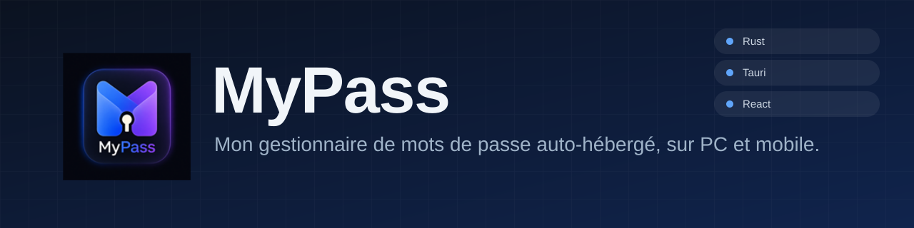
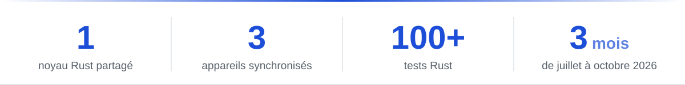
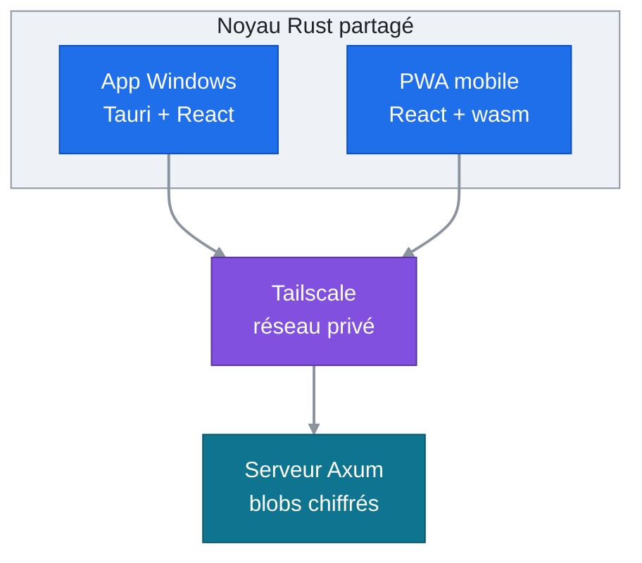
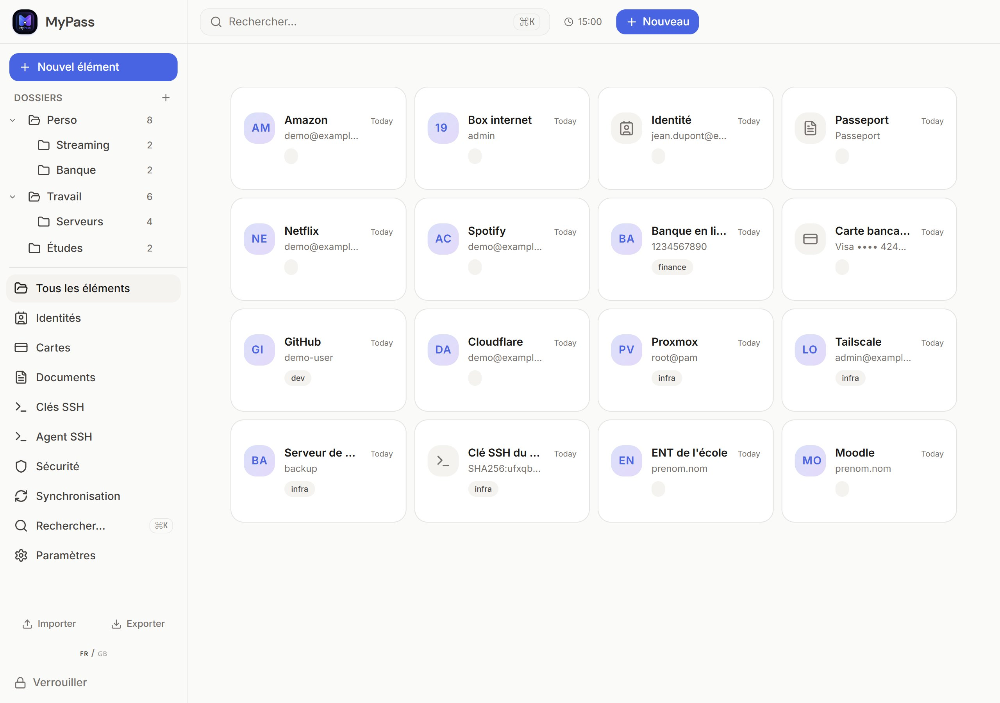
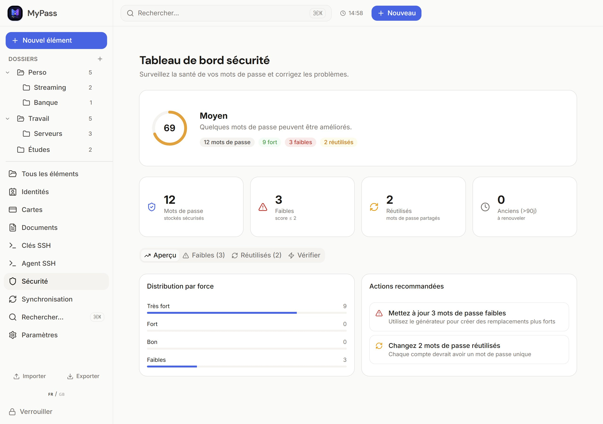
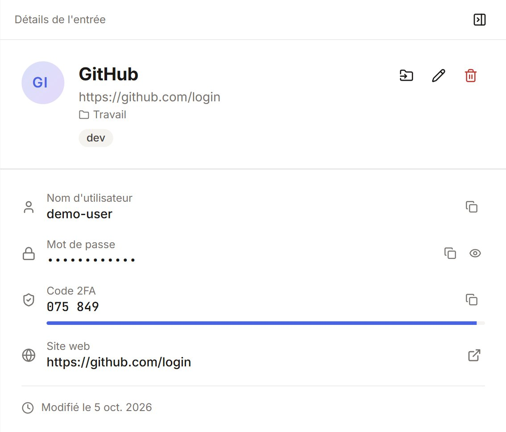

<div align="center">

<picture>
  <source media="(max-width: 600px)" srcset="assets/banner-mobile.svg">
  
</picture>

### Un seul coffre chiffré, synchronisé entre mes PC et mon téléphone.


**Français** · [English](README.en.md)

[En bref](#en-bref) · [La solution](#la-solution) · [Aperçu](#aperçu) · [Choix techniques](#choix-techniques) · [Installation](#installation)

<p align="center">
  <picture>
    <source media="(max-width: 600px)" srcset="assets/stats-mobile.svg">
    <source media="(prefers-color-scheme: dark)" srcset="assets/stats-dark.svg">
    
  </picture>
</p>

</div>

## En bref

| Rubrique | Détail |
|:--|:--|
| **Contexte** | Projet personnel, utilisé au quotidien à la place de mon ancien gestionnaire de mots de passe |
| **Mon rôle** | Conception, choix techniques et déploiement. Le code est écrit avec Claude Code, que je pilote |
| **Durée** | 3 mois, de juillet à octobre 2026 |
| **Stack** | Rust, Tauri v2, React 19, TypeScript, Tailwind, WebAssembly, Axum, Tailscale |
| **Compétences** | Architecture logicielle, Rust, sécurité applicative, déploiement d'un service sous Linux |
| **Statut** | En service : app Windows sur 2 PC, PWA sur mon téléphone, serveur de synchronisation sur un conteneur LXC |

## Le problème

Je voulais un gestionnaire de mots de passe complet : un coffre qui me suit sur mes deux PC et mon téléphone, avec les codes 2FA, les clés SSH et le remplissage dans le navigateur. Mais je ne voulais pas confier le coffre à un service tiers, ni l'exposer sur Internet.

## La solution

Le coffre est un seul fichier chiffré. Chaque appareil le déchiffre en local, avec un noyau Rust écrit une seule fois. Un petit serveur Axum, que j'héberge dans un conteneur LXC sur Proxmox, ne garde que des copies chiffrées et versionnées du fichier : il ne possède aucune clé. Les appareils lui parlent par Tailscale, donc rien n'est ouvert sur Internet.



Ce que fait l'application :

- **Cinq types d'éléments** : identifiants, cartes d'identité, cartes bancaires, documents, clés SSH.
- **Codes 2FA (TOTP)** avec compte à rebours, dossiers, recherche rapide, thèmes clair et sombre, français et anglais.
- **Générateur** de mots de passe et de phrases secrètes.
- **Tableau de bord sécurité** : mots de passe faibles, réutilisés ou anciens, et recherche de fuites avec HIBP (seul un préfixe SHA-1 quitte l'appareil).
- **Import** de fichiers CSV (Google, Apple, KeePassXC, Bitwarden) avec traitement des doublons, **export** en JSON ou CSV.
- **Remplissage dans Chrome et Edge** : une extension KeePassXC-Browser adaptée dialogue avec l'application par Native Messaging.
- **Agent SSH** Windows : les clés du coffre servent aux connexions SSH, avec une confirmation à chaque signature.
- **Mises à jour automatiques** : l'application propose les nouveaux `.msi` signés au démarrage.
- **Verrouillage automatique** après 15 minutes par défaut, presse-papiers vidé au bout de 30 secondes.

## Aperçu

<table>
  <tr>
    <td colspan="2" valign="top">
      
      <p align="center"><sub>Tous les éléments, avec les dossiers à gauche</sub></p>
    </td>
  </tr>
  <tr>
    <td width="60%" valign="top">
      
      <p align="center"><sub>Le tableau de bord sécurité</sub></p>
    </td>
    <td width="40%" valign="top">
      
      <p align="center"><sub>Une entrée avec son code 2FA</sub></p>
    </td>
  </tr>
</table>

Captures de l'application desktop avec un coffre de démonstration : toutes les données sont fictives.

## Choix techniques

| Choix | Ce que ça apporte |
|:--|:--|
| Un noyau Rust partagé (`mypass-core`) | Le coffre, le chiffrement, la fusion et le TOTP existent une seule fois. Le desktop l'appelle en natif, la PWA le charge en WebAssembly. |
| Un serveur qui stocke des blobs chiffrés | Le serveur ne détient aucune clé. J'ai écarté une API par entrée et un simple WebDAV : la première obligeait à réécrire la persistance, le second ne donnait pas d'application web. |
| Fusion par entrée, dernière écriture gagnante | Deux appareils peuvent modifier le coffre sans se bloquer. Les suppressions sont conservées pour ne pas ressusciter une entrée. |
| Tailscale | Aucun port ouvert sur Internet, un accès par appareil que je peux révoquer, et l'HTTPS dont la PWA a besoin (`tailscale serve`). |
| Extension KeePassXC-Browser adaptée | Je réutilise une extension éprouvée et son protocole (NaCl box, Native Messaging) plutôt que d'en écrire une. |
| `.msi` signé et manifeste publié en dernier | Aucun PC ne voit une nouvelle version avant que son installeur soit en ligne, et la signature est vérifiée avant l'installation. |
| CSP stricte et effacement des secrets | Le mot de passe maître et le fichier clé sont effacés de la mémoire au verrouillage. L'application n'envoie aucune requête tierce, hormis la recherche de fuites HIBP à la demande. |

> [!NOTE]
> Le fichier de coffre reprend la structure d'un KDBX (en-tête, dérivation Argon2, contenu XML) mais il est chiffré en AES-256-GCM ou ChaCha20-Poly1305. KeePass ne peut pas l'ouvrir : l'échange avec d'autres outils passe par l'import et l'export JSON ou CSV.

## Difficulté principale

**Faire tourner le même noyau dans le navigateur.** Le desktop appelle `mypass-core` en natif, la PWA le compile en WebAssembly. Trois points ont demandé de l'attention :

1. **L'horloge.** `SystemTime::now()` compile en wasm mais plante à l'exécution. La fusion s'appuie sur la date de dernière modification : une horloge morte aurait cassé la synchronisation sans aucun message. Toute l'heure du noyau passe donc par un seul module, qui lit `Date.now()` dans le navigateur.
2. **L'aléatoire et les dépendances.** Sur wasm32, il faut activer le backend JavaScript de `getrandom`, et une option de `totp-rs` tirait une version de `rand` incompatible avec la cible : je l'ai laissée désactivée.
3. **Des formes JSON identiques.** Le front appelle une seule fonction (`src/lib/tauri.ts`) qui choisit le backend : Tauri, WebAssembly ou un faux coffre en mémoire pour le développement. Les structures échangées sont les mêmes types `serde` du noyau, sérialisés en JSON des deux côtés, donc l'interface ne sait jamais où tourne le coffre.

## Installation

Pour reproduire l'ensemble : une application Windows, une PWA et un serveur de synchronisation. Les étapes 1 et 2 suffisent pour essayer l'application seule.

### Prérequis

| Élément | Version | Remarque |
|:--|:--|:--|
| Windows | 11 | Desktop et build de la PWA |
| Visual Studio Build Tools | récente | Charge de travail C++ |
| Rust | 1.85+ | Cible `wasm32-unknown-unknown` |
| Node.js | 24+ | Avec npm 11 |
| Serveur Linux | systemd | LXC ou VM, avec Rust |
| Tailscale | récente | Facultatif (HTTPS de la PWA) |

### Étapes

1. **Récupérer le dépôt et les dépendances.**

   ```bash
   git clone https://github.com/LucaAuvray/MyPass.git && cd MyPass
   rustup target add wasm32-unknown-unknown
   npm install
   ```

2. **Compiler le noyau en WebAssembly, puis lancer l'application.**

   ```bash
   npm run build:wasm
   npm run tauri dev
   ```

   Vérifier : la compilation se termine par `Your wasm pkg is ready to publish`, puis une fenêtre MyPass s'ouvre sur « Aucun coffre sur ce PC ». Créer un coffre avec un mot de passe maître.

3. **Compiler le serveur** sur la machine Linux, puis créer l'utilisateur et les dossiers.

   ```bash
   cd server && cargo build --release
   install -m 755 target/release/mypass-server /usr/local/bin/
   useradd --system --home /var/lib/mypass mypass
   install -d -o mypass -g mypass -m 700 /var/lib/mypass
   install -d /opt/mypass-web /opt/mypass-downloads
   ```

4. **Créer le service.** Fichier `/etc/systemd/system/mypass-server.service` :

   ```ini
   [Unit]
   Description=MyPass sync server
   After=network-online.target
   Wants=network-online.target

   [Service]
   User=mypass
   Group=mypass
   Environment=MYPASS_DATA_DIR=/var/lib/mypass
   Environment=MYPASS_BIND=127.0.0.1:8787
   Environment=MYPASS_STATIC_DIR=/opt/mypass-web
   Environment=MYPASS_DOWNLOAD_DIR=/opt/mypass-downloads
   ExecStart=/usr/local/bin/mypass-server
   Restart=on-failure
   UMask=0077
   NoNewPrivileges=true
   ProtectSystem=strict
   ReadWritePaths=/var/lib/mypass
   ProtectHome=true
   PrivateTmp=true

   [Install]
   WantedBy=multi-user.target
   ```

5. **Démarrer le serveur, relever le jeton et exposer l'HTTPS.**

   ```bash
   systemctl daemon-reload && systemctl enable --now mypass-server
   journalctl -u mypass-server     # le jeton d'accès s'affiche ici, une seule fois
   tailscale serve --bg 8787       # HTTPS sur le réseau Tailscale
   ```

6. **Vérifier.** Le service répond sur son port local.

   ```console
   $ curl http://127.0.0.1:8787/api/health
   ok
   ```

7. **Publier la PWA.** La construire sur le PC (le serveur n'a besoin ni de Node, ni de wasm-pack), puis copier `dist/` dans le dossier `MYPASS_STATIC_DIR` du serveur.

   ```bash
   npm run build:web
   ```

   Ouvrir l'adresse du serveur sur le téléphone, puis l'ajouter à l'écran d'accueil.

8. **Relier l'application desktop au serveur.** Dans l'écran « Synchronisation », saisir l'adresse du serveur et le jeton. Sur un autre PC, « Récupérer mon coffre depuis le serveur » installe le coffre existant.

> [!TIP]
> Le jeton n'est jamais stocké en clair : le serveur ne garde que son hash Argon2 (`token.hash`). Jeton perdu : supprimer ce fichier et redémarrer le service, un nouveau jeton s'affiche.

### Mises à jour automatiques

L'application lit l'adresse et la clé publique définies sous `plugins.updater` dans `src-tauri/tauri.conf.json`. Pour publier ses propres versions :

1. Créer une clé de signature une seule fois, puis reporter le contenu de `~/.tauri/mypass.key.pub` dans `plugins.updater.pubkey` et `https://<serveur>/download/latest.json` dans `plugins.updater.endpoints`. Ne jamais committer la clé privée.

   ```bash
   npx tauri signer generate -w ~/.tauri/mypass.key
   ```

2. À chaque version, incrémenter `version` dans `src-tauri/Cargo.toml`, puis construire le `.msi` signé. Le script écrit aussi `latest.json` dans `src-tauri/target/release/bundle/msi/`.

   ```bash
   npm run release
   ```

3. Copier le `.msi` dans `MYPASS_DOWNLOAD_DIR`, puis `latest.json` en dernier.

### Extension pour Chrome et Edge

1. Dans l'application : **Intégration navigateur**, puis activer l'intégration.
2. Une seule fois, depuis le dossier du dépôt (clés `HKCU` uniquement, sans droits administrateur) :

   ```powershell
   powershell -ExecutionPolicy Bypass -File register-nhm.ps1
   ```

3. Dans `chrome://extensions`, activer le mode développeur, puis **Charger l'extension non empaquetée** et choisir `keepassxc-browser/keepassxc-browser/`.
4. Dans l'extension, se connecter à MyPass pendant que le coffre est déverrouillé.

### Configuration du serveur

| Variable | Rôle |
|:--|:--|
| `MYPASS_DATA_DIR` | Dossier des coffres versionnés et de `token.hash` (`./data` par défaut) |
| `MYPASS_BIND` | Adresse d'écoute (`0.0.0.0:8787` par défaut) |
| `MYPASS_STATIC_DIR` | Dossier de la PWA servie. Facultatif |
| `MYPASS_DOWNLOAD_DIR` | Dossier des installeurs, servis sous `/download`. Facultatif |

Le serveur écoute en HTTP simple : l'HTTPS vient de Tailscale ou d'un reverse proxy. L'interface répond sur `/api/vault`, `/api/vault/versions` et `/api/health`, avec un jeton Bearer.

### Vérifier le projet

```bash
cargo test --manifest-path crates/mypass-core/Cargo.toml
cargo test --manifest-path server/Cargo.toml
cargo test --manifest-path src-tauri/Cargo.toml
npm run lint && npm run format:check && npm run build
```

### Dépannage

| Symptôme | Cause et solution |
|:--|:--|
| `npm run dev` affiche des données, mais rien n'est chiffré | Ce mode utilise un faux coffre en mémoire. Pour tester le vrai coffre, lancer `tauri dev` (desktop) ou `dev:web` (WebAssembly et vrai serveur). |
| `tauri build` échoue sur la signature | La clé `~/.tauri/mypass.key` est absente. Utiliser `npm run release` après l'avoir créée, ou ajouter `--no-bundle` pour un simple exécutable. |
| La PWA affiche l'ancienne version après un déploiement | Le service worker sert l'ancien build jusqu'au rechargement automatique. Sinon, le désinscrire et vider le cache du site. |
| `tar` échoue sur le serveur avec « Cannot change ownership » | L'archive vient d'un PC Windows : la décompresser avec l'option indiquée sous le tableau. |
| L'extension ne trouve pas MyPass | Vérifier que l'intégration est activée dans l'application, que `register-nhm.ps1` a été lancé, et que le coffre est déverrouillé. |
| Le pont de l'extension signale que le port 25798 est occupé | Une autre instance de MyPass tourne déjà et garde ce port local. La fermer, ou ignorer le message si l'extension fonctionne. |

Décompresser sur le serveur une archive créée sous Windows :

```bash
tar xzf dist.tgz --no-same-owner -C /opt/mypass-web
```

## Licence

MyPass est open source sous [licence MIT](LICENSE) : vous pouvez l'utiliser, le modifier et le redistribuer librement.
Le dossier `keepassxc-browser/` est une version adaptée de [KeePassXC-Browser](https://github.com/keepassxreboot/keepassxc-browser) et reste sous [GPL-3.0](keepassxc-browser/keepassxc-browser/LICENSE).

<br>

<div align="center">

<sub>Fait à Brest par <a href="https://github.com/LucaAuvray">Luca Auvray</a> · BTS SIO SISR · <a href="https://lauvray.info">lauvray.info</a></sub>

</div>
