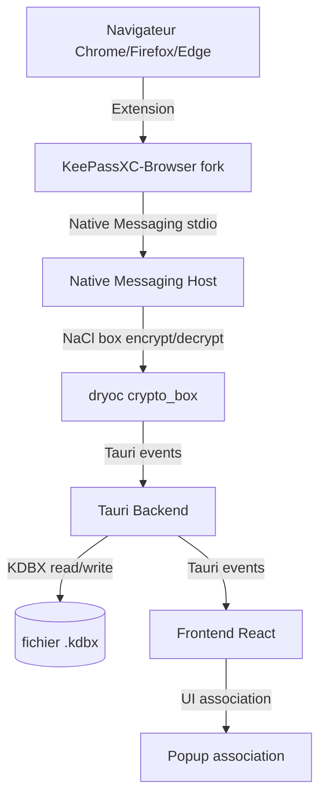

# Feature Plan — Intégration Navigateur (KeePassXC-Browser Protocol)

## 1. Objective

Permettre à l'extension KeePassXC-Browser (forkée) de communiquer avec MyPass via le protocole Native Messaging + NaCl box, pour l'auto-fill de mots de passe dans le navigateur.

## 2. Confirmed Requirements

| # | Requirement | Details |
|---|-------------|---------|
| R1 | Native Messaging Host intégré | Dans mypass.exe, pas de binaire séparé |
| R2 | NaCl crypto | dryoc (crate Rust pure, crypto_box) |
| R3 | Extension | Fork minimal de KeePassXC-Browser (changer ID native host + nom) |
| R4 | Full protocol | 16 actions du protocole KeePassXC-Browser |
| R5 | Association UX | L'utilisateur clique "Associer un navigateur" dans MyPass, puis l'extension se connecte |

## 3. Architecture Overview



### Protocol Flow

```
1. Browser extension starts → sends { action: "change-public-keys", publicKey, nonce }
2. MyPass receives → generates key pair → responds with { publicKey, nonce, success: true }
3. Browser sends { action: "associate", key, idKey }
4. MyPass stores association → responds with { success: true, hash }
5. All subsequent messages encrypted with NaCl box (shared key from ECDH)
6. Each message: action + encrypted payload + nonce + clientID
```

## 4. Protocol Actions (Full List)

### Browser → MyPass (requests)

| Action | Description | Priority |
|--------|-------------|----------|
| `change-public-keys` | Échange initial de clés publiques (NaCl handshake) | P0 |
| `associate` | Associer le navigateur au coffre | P0 |
| `test-associate` | Vérifier si l'association est valide | P0 |
| `get-logins` | Récupérer les credentials pour une URL | P0 |
| `set-login` | Créer/mettre à jour un credential | P0 |
| `generate-password` | Générer un mot de passe | P1 |
| `get-totp` | Récupérer le code TOTP d'une entrée | P1 |
| `lock-database` | Verrouiller le coffre | P1 |
| `get-databasehash` | Récupérer le hash du coffre | P1 |
| `get-database-groups` | Récupérer les groupes | P2 |
| `create-new-group` | Créer un nouveau groupe | P2 |
| `request-autotype` | Demander un auto-type global | P2 |
| `passkeys-register` | Enregistrer une passkey | P2 |
| `passkeys-get` | Récupérer une passkey | P2 |

### MyPass → Browser (events/notifications)

| Event | Description |
|-------|-------------|
| `database-locked` | Le coffre a été verrouillé |
| `database-unlocked` | Le coffre a été déverrouillé |

## 5. Native Messaging Host Design

### Registration

Le Native Messaging Host s'enregistre dans le système au lancement de MyPass :

**Windows** : Registry key
```
HKCU\Software\Mozilla\NativeMessagingHosts\com.mypass.mypass_browser
→ C:\Users\...\AppData\Roaming\MyPass\mypass_browser_manifest.json

HKCU\Software\Google\Chrome\NativeMessagingHosts\com.mypass.mypass_browser
→ C:\Users\...\AppData\Roaming\MyPass\mypass_browser_manifest.json
```

**macOS/Linux** : JSON file
```
~/Library/Application Support/Mozilla/NativeMessagingHosts/com.mypass.mypass_browser.json
~/.config/google-chrome/NativeMessagingHosts/com.mypass.mypass_browser.json
```

**Manifest content** :
```json
{
    "name": "com.mypass.mypass_browser",
    "description": "MyPass browser integration",
    "path": "C:\\Program Files\\MyPass\\mypass.exe",
    "type": "stdio",
    "allowed_extensions": ["mypass-browser@mypass.app"],
    "allowed_origins": ["chrome-extension://<ext-id>/"]
}
```

### Message Loop

Le NHM tourne dans un thread dédié :

```rust
fn native_messaging_loop() {
    let stdin = io::stdin();
    let stdout = io::stdout();
    
    loop {
        // 1. Read 4-byte length prefix (little-endian u32)
        let mut len_buf = [0u8; 4];
        stdin.read_exact(&mut len_buf)?;
        let msg_len = u32::from_le_bytes(len_buf);
        
        // 2. Read message body
        let mut msg_buf = vec![0u8; msg_len as usize];
        stdin.read_exact(&mut msg_buf)?;
        
        // 3. Parse JSON: { action, message, nonce, clientID }
        let msg: NativeMessage = serde_json::from_slice(&msg_buf)?;
        
        // 4. Decrypt with NaCl box (if action != "change-public-keys")
        let decrypted = if msg.action != "change-public-keys" {
            nacl_decrypt(&msg.message, &msg.nonce, &shared_key)?
        } else {
            msg.message
        };
        
        // 5. Parse inner action and route to handler
        let response = handle_action(&msg.action, &decrypted, &msg.clientID)?;
        
        // 6. Encrypt response
        let encrypted = nacl_encrypt(&response, &shared_key);
        let nonce = generate_nonce();
        
        // 7. Build response message
        let resp = NativeResponse { message: encrypted, nonce, clientID: msg.clientID };
        let resp_json = serde_json::to_vec(&resp)?;
        
        // 8. Write 4-byte length + response
        let resp_len = (resp_json.len() as u32).to_le_bytes();
        stdout.write_all(&resp_len)?;
        stdout.write_all(&resp_json)?;
        stdout.flush()?;
    }
}
```

### Thread lifecycle

- Démarré quand l'utilisateur active l'intégration navigateur dans les settings
- Le stdin/stdout est attaché au processus par le navigateur (Native Messaging standard)
- Tourne en continu jusqu'à ce que stdin soit fermé (le navigateur ferme la connexion) ou que MyPass se ferme

## 6. NaCl Crypto with dryoc

### Dependencies
```toml
[dependencies]
dryoc = "0.6"  # crypto_box, crypto_box_keypair, crypto_secretbox
```

### Current nacl.rs → refactor

Le fichier [`nacl.rs`](src-tauri/src/security/nacl.rs) actuel a des structures customs. On les remplace par dryoc :

```rust
use dryoc::box_::{Box, KeyPair, Nonce, PublicKey, SecretKey};
use dryoc::types::StackByteArray;

// Key exchange (ECDH + encryption)
pub fn encrypt_message(
    plaintext: &[u8],
    nonce: &[u8; 24],
    their_public_key: &[u8; 32],
    our_secret_key: &[u8; 32],
) -> Result<Vec<u8>, String> {
    let nonce = Nonce::from_slice(nonce).map_err(|e| format!("Invalid nonce: {e}"))?;
    let their_pk = PublicKey::from_slice(their_public_key).map_err(|e| format!("Invalid key: {e}"))?;
    let our_sk = SecretKey::from_slice(our_secret_key).map_err(|e| format!("Invalid key: {e}"))?;
    
    Box::encrypt_to_curve25519xchacha20poly1305(
        plaintext, &nonce, &their_pk, &our_sk
    ).map_err(|e| format!("Encrypt error: {e}"))
}

pub fn decrypt_message(
    ciphertext: &[u8],
    nonce: &[u8; 24],
    their_public_key: &[u8; 32],
    our_secret_key: &[u8; 32],
) -> Result<Vec<u8>, String> {
    let nonce = Nonce::from_slice(nonce).map_err(|e| format!("Invalid nonce: {e}"))?;
    let their_pk = PublicKey::from_slice(their_public_key).map_err(|e| format!("Invalid key: {e}"))?;
    let our_sk = SecretKey::from_slice(our_secret_key).map_err(|e| format!("Invalid key: {e}"))?;
    
    Box::decrypt_from_curve25519xchacha20poly1305(
        ciphertext, &nonce, &their_pk, &our_sk
    ).map_err(|e| format!("Decrypt error: {e}"))
}
```

## 7. Extension Fork (KeePassXC-Browser)

### Changes minimales

| Fichier | Modification |
|---------|-------------|
| `manifest.json` | `name`: "MyPass Browser", `allowed_origins` → native host `com.mypass.mypass_browser` |
| `background/keepass.js` | `kpcServerUrl`: pas besoin (stdio, pas HTTP), changer les constantes |
| `common/global.js` | `kpxcServerUrl`: idem |
| Icônes | Remplacer les icônes KeePassXC par MyPass |

### ID du native messaging host
- **Actuel** (KeePassXC): `org.keepassxc.keepassxc_browser`
- **Nouveau** (MyPass): `com.mypass.mypass_browser`

### Installation de l'extension
- Chrome/Edge : charger en mode développeur depuis `extension/`
- Firefox : charger en mode temporaire ou signer via AMO
- Distribution future : Chrome Web Store + Firefox Add-ons

## 8. Frontend UI

### Page Settings → onglet "Navigateur"

```
┌─────────────────────────────────────────┐
│  🌐 Intégration navigateur              │
│                                         │
│  [✓] Activer l'intégration navigateur   │
│                                         │
│  État : Non connecté                    │
│                                         │
│  [Associer un navigateur]               │
│                                         │
│  Navigateurs associés :                 │
│  ┌──────────────────────────────────┐   │
│  │ Chrome  —  Associé le 03/07/26   │   │
│  │ [Dissocier]                      │   │
│  └──────────────────────────────────┘   │
│                                         │
│  Extension : MyPass Browser v1.10.3     │
│  Protocole : KeePassXC-Browser v2.0     │
└─────────────────────────────────────────┘
```

### États :
- **Désactivé** : toggle OFF, tout grisé
- **Activé, non connecté** : toggle ON, bouton "Associer" actif
- **En attente d'association** : spinner + "En attente de connexion du navigateur..."
- **Connecté** : badge vert, liste des navigateurs associés
- **Erreur** : message d'erreur avec bouton réessayer

## 9. Tauri Backend

### Nouveau module : `src-tauri/src/native_messaging.rs`

Responsabilités :
- `start_native_messaging()` — enregistre le manifest et démarre le thread stdio
- `stop_native_messaging()` — arrête le thread et désenregistre
- `native_messaging_loop()` — boucle stdin/stdout
- `handle_action()` — route les actions vers les commandes existantes

### Nouvelles commandes Tauri
- `start_browser_integration()` — lance le NHM
- `stop_browser_integration()` — arrête le NHM
- `get_browser_status()` — état actuel (déjà stub, à implémenter)
- `associate_browser(id_key: String)` — associe un navigateur
- `disassociate_browser(id_key: String)` — dissocie

### Events Tauri (backend → frontend)
- `browser-connected` — un navigateur s'est connecté
- `browser-disconnected` — un navigateur s'est déconnecté
- `browser-associated` — association réussie
- `browser-auth-request` — demande d'autorisation (pour l'UX "popup de confirmation" future)

### Modifications des commandes existantes

[`browser.rs`](src-tauri/src/commands/browser.rs) :
- `get_browser_status` : retourner l'état réel (plus mock)
- `start_native_messaging` : appeler `native_messaging::start()`
- `stop_native_messaging` : appeler `native_messaging::stop()`
- `is_browser_integration_enabled` : lire depuis le fichier de config MyPass
- `toggle_browser_integration` : écrire dans le fichier de config + start/stop NHM
- `get_associated_browsers` : déjà implémenté ✅
- `handle_get_logins` : déjà implémenté ✅
- `handle_set_login` : déjà implémenté ✅

## 10. Files Involved

### New files

| File | Purpose |
|------|---------|
| [`src-tauri/src/native_messaging.rs`](src-tauri/src/native_messaging.rs) | Native Messaging Host: stdio loop, message routing, NaCl crypto |
| [`src/components/settings/BrowserSettings.tsx`](src/components/settings/BrowserSettings.tsx) | UI settings page for browser integration |
| [`extension/`](extension/) (updated) | Forked KeePassXC-Browser extension with MyPass branding |

### Modified files

| File | Changes |
|------|---------|
| [`src-tauri/src/security/nacl.rs`](src-tauri/src/security/nacl.rs) | Replace custom NaCl with dryoc crypto_box |
| [`src-tauri/src/commands/browser.rs`](src-tauri/src/commands/browser.rs) | Implement stub commands, connect to native_messaging |
| [`src-tauri/src/commands/mod.rs`](src-tauri/src/commands/mod.rs) | Add native_messaging module |
| [`src-tauri/src/lib.rs`](src-tauri/src/lib.rs) | Register new commands, init NHM on startup if enabled |
| [`src-tauri/Cargo.toml`](src-tauri/Cargo.toml) | Add `dryoc` dependency |
| [`src/i18n/fr.json`](src/i18n/fr.json) | Add `browser.*` translation keys |
| [`src/i18n/en.json`](src/i18n/en.json) | Add `browser.*` translation keys |

## 11. Message Format (KeePassXC-Browser Protocol)

### Request (Browser → MyPass)
```json
{
    "action": "get-logins",
    "message": "<base64-encoded encrypted JSON>",
    "nonce": "<base64 24-byte nonce>",
    "clientID": "<base64 client identifier>"
}
```

### Response (MyPass → Browser)
```json
{
    "message": "<base64-encoded encrypted JSON>",
    "nonce": "<base64 24-byte nonce>",
    "clientID": "<base64 client identifier>"
}
```

### Inner message (decrypted)

**get-logins request:**
```json
{
    "action": "get-logins",
    "url": "https://example.com/login",
    "keys": [{ "id": "...", "key": "..." }],
    "httpAuth": false,
    "submitUrl": "https://example.com/login"
}
```

**get-logins response:**
```json
{
    "count": 2,
    "entries": [
        {
            "login": "user@example.com",
            "name": "Example",
            "password": "my-password",
            "uuid": "abc-123",
            "stringFields": [{ "K": "Notes", "V": "..." }]
        }
    ],
    "nonce": "...",
    "success": true
}
```

## 12. Edge Cases

| # | Edge Case | Handling |
|---|-----------|----------|
| E1 | Coffre verrouillé quand le navigateur demande des credentials | Répondre avec `{ error: "Database locked" }` |
| E2 | Extension non associée | Ignorer les requêtes sans association valide |
| E3 | Stdin fermé par le navigateur | Clean exit du thread NHM |
| E4 | Erreur de décryptage NaCl | Log + répondre avec erreur |
| E5 | mypass.exe pas lancé quand le navigateur essaie de se connecter | Le navigateur réessaiera automatiquement |
| E6 | Plusieurs navigateurs connectés simultanément | Chaque navigateur a son propre clientID, sessions indépendantes |
| E7 | Changement de mot de passe maître | Invalider toutes les associations (le hash change) |
| E8 | Fichier manifest déjà existant (autre installation) | Écraser avec le bon chemin |

## 13. i18n Keys

```json
{
  "browser": {
    "title": "Intégration navigateur",
    "enable": "Activer l'intégration navigateur",
    "statusConnected": "Connecté",
    "statusDisconnected": "Non connecté",
    "statusWaiting": "En attente de connexion...",
    "associate": "Associer un navigateur",
    "disassociate": "Dissocier",
    "associatedBrowsers": "Navigateurs associés",
    "noBrowsers": "Aucun navigateur associé",
    "extensionVersion": "Extension",
    "protocolVersion": "Protocole",
    "associatedOn": "Associé le {{date}}",
    "errorConnection": "Erreur de connexion au navigateur",
    "browserChrome": "Chrome",
    "browserFirefox": "Firefox",
    "browserEdge": "Edge"
  }
}
```

## 14. Step-by-Step Todo List

1. **Ajouter `dryoc`** dans `Cargo.toml`
2. **Remplacer `nacl.rs`** — utiliser dryoc pour crypto_box encrypt/decrypt
3. **Créer `native_messaging.rs`** — stdio loop, message parsing, action routing
4. **Implémenter `browser.rs`** — connecter les stubs à native_messaging
5. **Enregistrer le manifest** — fonction pour créer le fichier JSON et la registry key
6. **Ajouter les events Tauri** — `browser-connected`, `browser-associated`, etc.
7. **Créer `BrowserSettings.tsx`** — UI settings
8. **Ajouter les traductions** — `browser.*` dans fr.json et en.json
9. **Forker l'extension** — modifier `manifest.json` + `keepass.js` dans `extension/`
10. **Intégrer dans `lib.rs`** — init NHM au lancement si enabled
11. **Tests** — vérifier que le NHM démarre, que l'extension peut se connecter, que get-logins fonctionne
